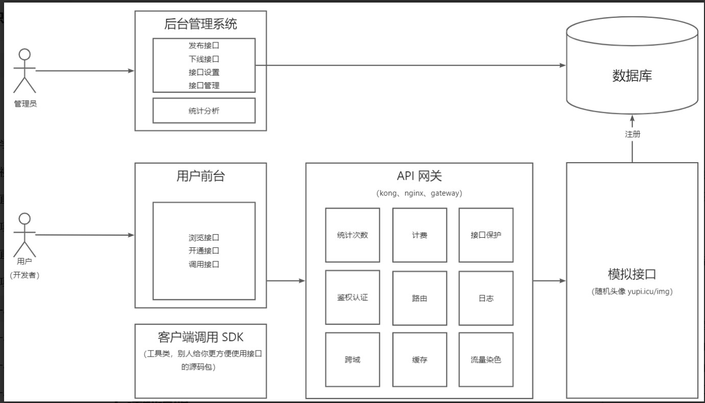

# 开放API平台
&nbsp;&nbsp;本项目是提供给开发者的开放api平台，提供api接口给开发者调用。用户通过登录注册
获取调用接口权限，可以浏览接口，对用户的接口调用进行统计。管理员可以发布接口、上线接口、下线接口。通过本项目的学习，你能够学习到
更多架构层面设计的知识。

## 项目流程概述
本项目涉及到5个子系统的开放： 
1.**模拟接口系统**:提供各种接口给开发者调用，类似于简单的后端Http应用 
2.**后台管理系统**:管理员可以上线接口、下线接口，设置用户的接口调用数量，以及
查看用户的接口使用情况 
3.**API网关系统**:负责路由，安全防护，调用统计等，抽取接口系统的公共逻辑 
4.**第三方SDK调用工具**:封装Http调用逻辑，以springboot-starter形式引入，开箱即用 
5.**前台系统**:前台展示可以调用的接口，以及对各个接口的详细说明 

## 后端技术栈
SpringBoot+Mysql+MybatisPlus+Swagger(接口文档)+Spring Cloud Gateway+Dubbo+Hutool、Gson等工具库

## 开放接口调用流程
&nbsp;&nbsp;启动nacos，本项目LtApi，网关ltapi-gateway，开放接口ltapi-interface，
其中ltapi-client-sdk和LtApi-interface这两个包需要在本项目和网关中引入。 
&nbsp;&nbsp;前端发起接口调用，传入需要调用的接口id以及调用参数，映射到本项目LtApi的controller层的invoke方法，
先对接口进行校验（校验是否存在以及是否关闭下线）。获取登录用户accessKey、secretKey以及调用接口url，
将这三个参数传入SDK创建ApiClient调用对象，将传入的调用参数requestParams封装成对象传入apiClient的调用方法中
发起http调用(其中在SDK中，对http调用进行封装，并根据传入参数和密钥secretKey使用加密算法生成签名。同时会生成
随机数以及时间戳放到requestHeader中)。 
&nbsp;&nbsp;根据url在SDK中发起调用，请求会到达网关，网关会进行路由，将请求路由到后台interface，
在请求之前，网关中的过滤器会对参数进一步校验。首先获取请求头中的一系列信息，包括“请求参数，方法，
来源地址等”。在网关中设置了黑白名单，指定只有来源是当前服务器的请求才会通过。下面需要鉴权：
根据requestHeader中的accessKey，从数据库中查询密钥secretKey(Dubbo远程调用)，使用使用相同的算法
根据密钥secretKey生成签名，将该签名和requestHeader中的签名进行对比，不相同抛出异常。
当前面的校验合法时，对该请求放行。请求到达interface后台接口，调用成功之后返回网关
过滤器，过滤器中发现调用成功之后打印日志，发起远程调用修改该用户的调用次数。

